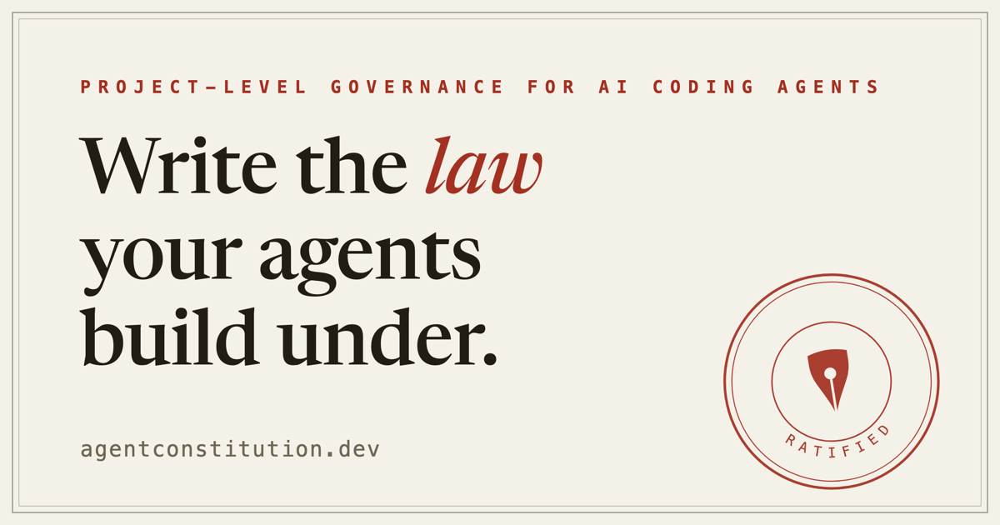

<div align="center">

# Agent Constitution

**Write the law your agents build under.**

*The constitution is the artifact. Ratification is the product.*

[](https://agentconstitution.dev)


<a href="https://agentconstitution.dev">
  
</a>

</div>

Agents rarely wreck a project with absurd choices. They drift it with
defensible ones — locally correct, collectively fatal. An agent working
inside one corner of your codebase cannot see why the project exists, so
it makes the choice its training prefers, and session by session the work
walks away from the point. The constitution governing this repository
names the end state:

> Functional mediocrity: the average of all the weights.

Rules files cannot stop this. They govern tactics: formatting, naming,
tool use. Drift happens higher, in architecture, scope, dependencies, and
product intent. Agent Constitution operates at that altitude. It ratifies
your project judgment into a `CONSTITUTION.md` that agents load before
high-level choices, cite when they decide, and are verified against when
the work is done.

## What you get

- **`write-constitution`** — a Socratic interview that extracts the
  judgment only you have, then ratifies it section by section. Nothing
  enters the document without your yes.
- **`constitution-decide`** — steers high-level choices by the ratified
  law, so direction stays yours even in sessions you never watch.
- **`constitution-verify`** — gates finished work with a PASS or FAIL
  verdict and clause citations. No scores, no partial credit.
- **Three portable markdown files, 1,013 lines, zero dependencies** —
  auditable in an afternoon, and they run in any harness that loads
  markdown skills: Claude Code, Codex, Pi.
- **Wiring included** — ratification writes a digest into `AGENTS.md` and
  `CLAUDE.md`, so existing rules files stay in place and agents pick up
  the law unprompted.

## Quick start

```bash
git clone --depth 1 https://github.com/stefan-vatov/agentconstitution
cp -r agentconstitution/skills/* .claude/skills/   # Codex: .codex/skills/
rm -rf agentconstitution
ls .claude/skills   # expect: constitution-decide constitution-verify write-constitution
```

Then, in an agent session inside your repo, say:

```text
write constitution
```

The interview asks open questions, one at a time, and probes every answer
with the conflict that will eventually happen. Budget about an hour.
Installation can be delegated to an agent; the interview cannot.

## The honest cost

There is no quick mode. The skills refuse to generate a constitution
without the interview, because a document sampled from the very weights it
exists to govern is drift dressed as law. If nobody will sit that hour,
this project is not for you.

## The evidence

- **An adversarial eval lab ships in the repo.** Six scenarios under
  [`evals/scenarios/`](evals/scenarios/), including a direct order to
  cross a boundary and a request to skip the interview. The
  [rubric](evals/rubric.md), judge definitions, and results are committed
  beside them.
- **This repository governs itself.** Its own
  [`CONSTITUTION.md`](CONSTITUTION.md) was ratified 2026-08-05 through its
  own interview; the skills that ship here are the skills that govern
  here.
- **Everything is inspectable.** The law, the skills, the evals, and the
  site are one public repo under MIT.

## Learn more

- [agentconstitution.dev](https://agentconstitution.dev/) — drift, document
  anatomy, lifecycle, installation
- [The mechanism](https://agentconstitution.dev/how-it-works) — why a
  constitution changes what agents sample at high-level choices
- [llms.txt](https://agentconstitution.dev/llms.txt) — the agent-readable
  summary of this project

## Companion project: Project Canon

[Project Canon](https://agentcanon.dev) keeps compact architectural laws
and product invariants for coding agents: why the system is shaped this
way and what must remain true. The constitution holds the human's
direction; Canon holds the system's laws. They compose, and this
repository runs both.

- Site: [agentcanon.dev](https://agentcanon.dev)
- Repository: [github.com/stefan-vatov/canon](https://github.com/stefan-vatov/canon)

## License

[MIT](LICENSE).
